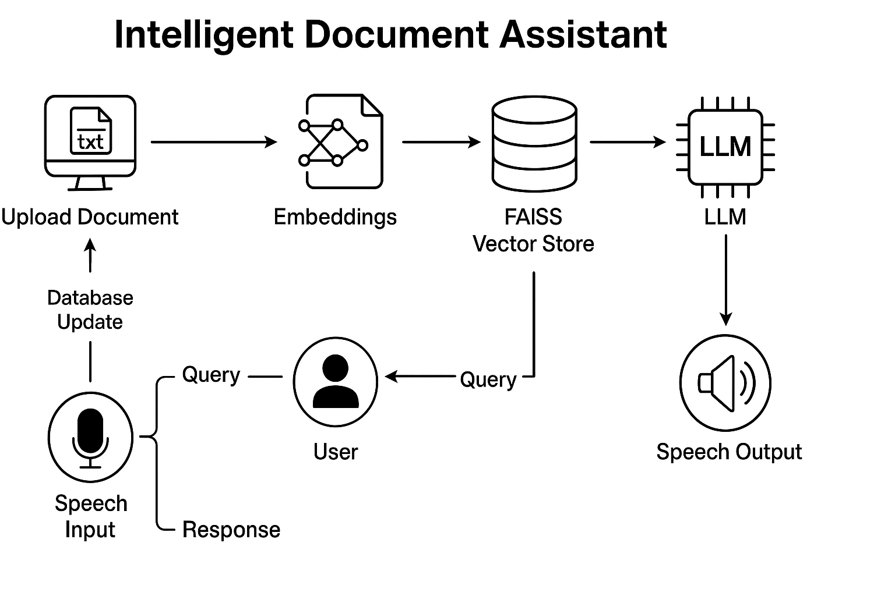

# 🤖 Intelligent Document Assistant (LLM-Powered)

A GenAI-based conversational assistant that answers user questions based solely on the content of provided documents. It leverages LLMs via AWS Bedrock, LangChain for orchestration, FAISS for vector search, and Whisper for voice-based interaction.

---

## 📌 Overview

**Intelligent Document Assistant** is a private, document-grounded AI chatbot. Users can upload PDFs, DOCX, or text files containing domain-specific knowledge — such as HR policies, project reports, or technical guidelines — and interact with the assistant through natural conversation. The assistant strictly answers questions based on the uploaded content, without relying on external knowledge.

> ⚠️ This repository contains only the README and architectural flow for understanding the system design. No datasets, models, or code are included due to company restrictions.

---

## 🔁 Key Features

- 📄 **Multi-Format Document Support** – Accepts `.pdf`, `.docx`, and `.txt` files
- 🧠 **LLM via Bedrock** – Language model integrated through Amazon Bedrock
- 📚 **Embedding + Vector Search** – Uses FAISS for document chunk retrieval
- 🔄 **Memory Control** – Reset existing knowledge or add new topics incrementally
- 🗣️ **Voice Interface** – Whisper-based speech-to-text + voice output for conversation
- 🌐 **Private Knowledge Scope** – Assistant answers *only* from the user's uploaded content
- 🗨️ **Friendly Bot Interface** – Chat-style frontend for natural interactions

---

## 🧠 Architecture



---

## 🛠 Tech Stack

| Component             | Tool/Service            |
|----------------------|-------------------------|
| LLM                  | Amazon Bedrock (Claude / Titan) |
| Orchestration        | LangChain               |
| Embedding            | Amazon Bedrock Embeddings |
| Vector DB            | FAISS                   |
| Voice Input          | Whisper + SpeechRecognition |
| Backend              | Python (FastAPI)         |
| Frontend             | Streamlit                |

---

## 🎯 Objective

To create a reliable, scoped GenAI assistant that allows users to upload custom documents and query the content in natural language. The system ensures contextual relevance, privacy, and dynamic knowledge base control.

---

## 🔄 Pipeline Overview

1. **📁 File Upload**  
   Users upload `.pdf`, `.docx`, or `.txt` files containing the domain-specific content.

2. **🔍 Embedding + Indexing**  
   Each document is split into chunks, embedded using Bedrock, and stored in a FAISS index.

3. **🧠 LLM Setup via LangChain**  
   A retrieval-based QA chain is built using LangChain to restrict the LLM’s answers to the indexed content.

4. **🧹 Memory Control**  
   Users can reset the full knowledge base or append new content to expand the assistant’s scope.

5. **🎙️ Voice Interface**  
   - User input can be given via voice using Whisper for transcription  
   - The assistant responds via text or optionally via speech synthesis

6. **🗨️ Interaction**  
   The user chats with the assistant, who responds contextually from the loaded knowledge only.

---

## 📥 Example Output (Simulated)

```json
{
  "query": "What is the reimbursement process for local travel?",
  "response": "According to Section 3.1 of the HR Travel Policy, local travel must be pre-approved and reimbursed with valid receipts within 7 days.",
  "source": "travel_policy.pdf"
}
```
---

## 🧾 Use Cases

- ✅ **HR Policy Assistant**  
  Let employees query leave, travel, and compliance policies conversationally.

- ✅ **Project Documentation Q&A**  
  Answer questions from large technical docs, reports, or meeting transcripts.

- ✅ **Academic Guide**  
  Help students or faculty interact with syllabi, course notes, or university handbooks.

- ✅ **Legal Document Reader**  
  Chat with contracts or legal briefs using a scoped, private assistant.

---

## 🔒 Disclaimer

This repository demonstrates a professional-grade application structure and processing pipeline.  
It **does not include** proprietary data, production-trained models, or confidential credentials.  
You are free to adapt the structure, pipeline logic, and modular components for educational, testing, or private deployments.

---

## 👨‍💻 Author

**Goutham Sidhik**  
AI/ML Engineer | Computer Vision & GenAI Developer  
[LinkedIn](https://www.linkedin.com/in/goutham-sidhik-amuluru-50231b163/)
